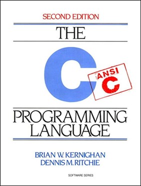
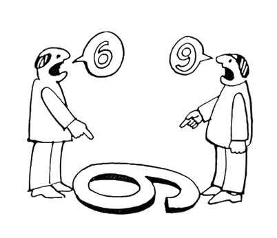
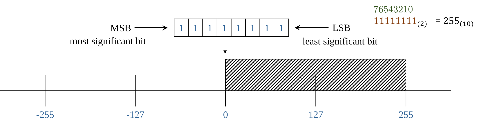

<!-- _class: lead -->
<!-- _paginate: skip -->

# CSCI 232
## 232 Algorithms & Data Structures
### Lecture: 1
J. L. Pach 


---
# Outline:

- Syllabus, Textbook, Canvas
- Introduction
- History of C
- Positional notation
- IDE
- Hello World
- Compiler vs Interpreter


---

<!-- _class: caption-slide -->
<!-- _paginate: skip -->

# Syllabus
<!-- ## Subtitle -->


---

# Some basic facts about the course

<div class="columns">
<div class="card">

## Course Name:
-	Programming with C (CSCI 112)

## Credit Hours:
- 3 credits 
- 1 hour lecture twice a week
- 3 hours lab per week

</div>
<div class="card">

## Lecture (Mondays and Fridays)
- 12:00 – 12:50 PM. 
- Science & Engineering Building (S&E) 308
## Lab (Mondays)
- 2:00 – 4:50 PM
- Engineering Lab/Classroom Building (ELC) 315

</div></div>

---
# Syllabus

- Course Description

- Textbooks

- Class Rules 

- Grading

- Accommodations & Academic Dishonesty

- Declaration of authorship

<!-- 
TUTAJ WPISZ TO, CO CHCESZ POWIEDZIEĆ:
- Przywitaj studentów CSCI 112.
- Podkreśl, że IDE to nie tylko edytor, ale cały ekosystem.
- Wspomnij o debuggerze jako narzędziu, które oszczędza godziny pracy.
-->

---
# Course Description

<div class = "card justify">

##
This course provides a comprehensive introduction to structured programming using the C language. Student will gain a deep understanding of memory management techniques such as pointers and dynamic allocation. The skills acquired in this course will be essential for those who wish to pursue further studies in languages like C++, C#, and Java, as well as microcontroller programming. Additionally, this course will lay a strong foundation for understanding computer architecture.

</div>

---
# …a few words

<div class = "card justify">

##

_This course is designed for students in:_

- Computer Science (CS),

- Software Engineering (SE), 

- Electronics programs. 

_No prior programming experience is required — only basic computer literacy, such as using a web browser, email, and navigating the MS Windows environment._


</div>

---

# Textbooks

_Brian W. Kernighan, Dennis M. Ritchie. C Programming Language, 2nd Edition. Prentice Hall, 1988_

<div class="columns">
<div


Dennis M. Ritchie

</div>
<div>


</div></div>

---


# ANSI(C89) vs C99


<div class = "justify">


- Last year, the course was taught using the oldest and most widely adopted ANSI standard — C89. This choice was made because C89 does not include many of the conveniences introduced in later versions. While these conveniences make life easier for professional programmers, they can make it harder for beginners to fully grasp the fundamentals of programming in C. 

- The standard now used in our classes is __C99__, which is widely applied in embedded systems, especially in the field of electronics. This standard significantly lowers the entry barrier for beginners (for example, allowing variable declarations inside a for loop and supporting single-line comments //), while avoiding the complex and sometimes confusing features introduced in newer standards.

</div>


---

# Course Rules

<div class = "lh-25">

1. This course is an in-person course.
1. Attendance at every class is required.
1. Excused Absences. If there is any medical or any other kind of emergency, please let the instructor know immediately.
1. Makeup exams will only be given if you bring a valid medical documentation. 
1. Each task without a sample required comment (below) is worth zero points.

</div>

---

# Grading

**The course grade will be determined by two equally weighted components:**

- the lecture component (40%) 
- the laboratory component (60%). 

<br>**The laboratory component will be evaluated based on three criteria:**

- entrance quiz (30%), 
- assignment (40%), 
- brief concluding quiz (30%). 


---

# Laboratory Rules

<div class = "justify">

**Entrance Quiz (optional):**

- If included, the entrance quiz will consist of 3 questions. To pass, a student must score at least 2 points. Failed entrance quizzes may be retaken up to two times during the semester. Only failed quizzes can be retaken.

**Assignment:**
- Students will have 6 days to complete and submit their assignment.

<br>**Brief Concluding Quiz (optional):**
- If included, this quiz serves as a summative assessment component, reinforcing the material covered during the lab session.

</div>


---

# Details

<div class = "justify">

**Accommodations:**

- Students who need any type of accommodation should work with Montana Tech Disability Services and provide appropriate documentation as soon as possible.

**Academic Dishonesty:**
- You are encouraged to work in teams and use many resources including books and the Internet.  However, each student must turn in his/her own work, and each student is responsible for understanding anything that is turned in. Refer to the Student Conduct Code for more information regarding plagiarism and cheating.
</div>


---

# Declaration of authorship

<div class = "justify lh-20">
<i>
I acknowledge that I have worked on this assignment independently, except where explicitly noted and referenced. Any collaboration or use of external resources has been properly cited. I am fully aware of the consequences of academic dishonesty and agree to abide by the university's academic integrity policy. I understand the importance the consequences of plagiarism.
</i>
</div>

---

# Comments

<div class = "justify">

There must be 4 lines of comments at the top of each source file. This heading should include your name, the class and semester, and the assignment number, and required statement. Source file without this comment gets **zero** points.

**Template**
```
//Jakub Pach
//CSCI 112 Fall 2026
//Programming Assignment #1
//I acknowledge that I have worked on this assignment independently, except where explicitly noted and referenced...
```
</div>

---

# Canvas

## Lecture & Laboratory:<br><br>

### (76078) CSCI 112 Sec 01 :Programming with C 
<br>

## Check if you are registered for the course and have access to it!


---

<!-- _class: caption-slide -->
<!-- _paginate: skip -->

# Introduction
<!-- ## Subtitle -->


---

# Meaning of words
<div class = "justify lh-20">

Sometimes, when we look at the same thing, we see entirely different things. Therefore, to avoid misunderstandings, I will spend a considerable amount of time clarifying the nuances associated with translating the meanings of the concepts we will be using in our classes. All the material presented in this course will be of practical use.
 
</div>

---

# Compiler
<div class = "justify lh-20">

1. A compiler takes the entire source code and translates it into a machine code file, often called **an executable**. 

1. This executable file contains instructions that the computer's processor can directly execute. 

1. Once compiled, the program can run independently without the need for the original source code or a compiler.

</div>

---

# Interpreter
<div class = "justify lh-20">

1. An interpreter translates the source code **line by line** as the program is running. 

1. It doesn't create a separate executable file. Instead, it uses a virtual machine to execute the translated code. 

1. The virtual machine provides an environment that mimics a real computer, allowing the program to run even if the underlying hardware architecture is different.

</div>

---

# Compiler vs Interpreter
<div class = "justify lh-25">

Think of a compiler as a translator who translates an entire book from one language to another before you start reading it. An interpreter, on the other hand, is a translator who translates each sentence as you read it. A compiler translates the entire program at once, while an interpreter translates it line by line.

</div>

---

# History of C
<div class = "justify lh-25">

Similarly, in music, we first learn to read sheet music, and only after mastering the basics can we investigate  into the history and evolution of musical notation. In this course, we'll follow a similar approach. We'll start by learning how to write code in C, and we'll save the history of the C language for later, once you have gained significant experience. Then, we can explore the origins of certain language constructs.

</div>

---

<!-- _class: caption-slide -->
<!-- _paginate: skip -->

# Bit & Byte
<!-- ## Subtitle -->

---

# Bit & Byte
<div class = "justify lh-25">

 **A bit** is the smallest unit of data in a computer, representing a single binary value: either a **0** or a **1**. 

 **A byte** is a group of eight bits. A single byte can represent a wide range of values, such as a single character (like the letter **'A'** or the symbol '@') or an integer from **0 to 255**.

</div>

---

<!-- _class: caption-slide -->
<!-- _paginate: skip -->

# Positional notation
<!-- ## Subtitle -->

---

# Positional notation
<div class = "justify lh-15">

- Usually means the extension to any base (2, …, 8,10,16 etc.) of the Hindu–Arabic numeral system (or decimal system). 
- A positional system is a numeral system in which the contribution of a digit to the value of a number is the value of the digit multiplied by a factor determined by the position of the digit. 
- In modern positional systems, such as the decimal system, the position of the digit means that its value must be multiplied by some value: in 444, the three identical symbols represent four hundreds, four tens, and four units, respectively, due to their different positions in the digit string.


</div>

---

# Base of the numeral system 

<div class = "justify lh-20">

- In mathematical numeral systems the radix r is usually the number of unique digits, including zero, that a positional numeral system uses to represent numbers.
- The highest symbol of a positional numeral system usually has the value one less than the value of the radix of that numeral system. The standard positional numeral systems differ from one another only in the base they use.
- The radix is an integer that is greater than 1, since a radix of zero would not have any digits, and a radix of 1 would only have the zero digit. 

</div>

---

# Binary numeral system 

$$A = \sum_{i=0}^{n-1} R^i \cdot d_i$$

$$\overset{\color{#6d7e44}{2 \ 1 \ 0}}{123}_{(10)} = (10^{2} \cdot 1) + (10^{1} \cdot 2) + (10^{0} \cdot 3)$$

$$
\begin{array}{r}
  \color{#6d7e44}{\scriptsize 7 \  \ 6 \ \ \ 5 \ \ \ 4 \ \ \ 3 \ \ \ 2 \ \ \ 1 \ \ \ 0 \ \ \ \ } \\[-1em]
  \mathtt{0 \ 1 \ 1 \ 1 \ 1 \ 0 \ 1 \ 1}_{(2)}
\end{array} 
= (2^{7} \cdot 0) + (2^{6} \cdot 1) + (2^{5} \cdot 1) + (2^{4} \cdot 1) + (2^{3} \cdot 1) + (2^{2} \cdot 0) + (2^{1} \cdot 1) + (2^{0} \cdot 1) = 123_{(10)}
$$

---

# Converting decimal numbers to binary

## Steps:

<div class = "justify lh-20">

1. Divide the decimal number by 2. The remainder of the division will be either 0 or 1.
1. If the remainder is 0, write down a 0.
1. If the remainder is 1, write down a 1.
1. Repeat steps 2 and 3 until the decimal number is 0.
1. Read the numbers **from bottom to top** to get the binary number.

</div>

---

# Example
$$123_{10}$$

<div class="columns">
<div class="card">

- 123 / 2 = 61 (remainder 1)
- Write down a 1.
- 61 / 2 = 30 (remainder 1)
- Write down a 1.
- 30 / 2 = 15 (remainder 0)
- Write down a 0.
- 15 / 2 = 7 (remainder 1)
- Write down a 1.

</div>
<div class="card">

- 7 / 2 = 3 (remainder 1)
- Write down a 1.
- 3 / 2 = 1 (remainder 1)
- Write down a 1.
- 1 / 2 = 0 (remainder 1)
- Write down a 1.

</div></div>

---

<style scoped>
  table tbody td {
    padding: 0 !important;
  }
  table {
    width: 100%;
    margin: 0.8em 0;
    font-size: 16px;
  }
</style>

# Converting binary numbers to oct
$$1111011_{2}$$

<div class="columns">
<div>

| Radix | Value | Binary Value | Symbol |
| :--- | :---: | :---: | :---: |
| Octal | 0 | 0000 | 0 |
| Octal | 1 | 0001 | 1 |
| Octal | 2 | 0010 | 2 |
| Octal | 3 | 0011 | 3 |
| Octal | 4 | 0100 | 4 |
| Octal | 5 | 0101 | 5 |
| Octal | 6 | 0110 | 6 |
| Octal | 7 | 0111 | 7 |
| Hexadecimal | 8 | 1000 | 8 |
| Hexadecimal | 9 | 1001 | 9 |
| Hexadecimal | 10 | 1010 | A |
| Hexadecimal | 11 | 1011 | B |
| Hexadecimal | 12 | 1100 | C |
| Hexadecimal | 13 | 1101 | D |
| Hexadecimal | 14 | 1110 | E |
| Hexadecimal | 15 | 1111 | F |
</div>


001.111.011	= 1.7.3 
0111.1011	= 7.B

---

# Unsigned Representation



---

# Sign-Magnitude Representation


---

# Data in a computer 

## can essentially be stored using two standards: 

1. integers represented in binary,

1.  real (floating-point) numbers stored according to the IEEE 754 standard.


Everything else is a combination or interpretation based on these two fundamental forms of representation.

---

<!-- _class: caption-slide -->
<!-- _paginate: skip -->

# IDE
## Integrated development environment

---

# Integrated development environment

<div class="card justify lh-20">

An Integrated Development Environment (IDE) is a comprehensive software application that consolidates the essential tools needed for software development into a single graphical user interface. It typically combines:
1. a source **code editor** for writing code 
1. a **compiler** and **linker** to transform that code into an executable program.
1. a built-in **debugger** to help developers identify and resolve logical errors 

efficiently during the programming process.

</div>

---
# Integrated development environment


---

<!-- _class: caption-slide -->
<!-- _paginate: skip -->

# Thank
## You