<!-- _class: lead -->
<!-- _paginate: skip -->

# CSCI 232

## Data Structures and Algorithms

### Laboratory: 01

J. L. Pach

---
# Outline:

- Guide and rules
- File System Hierarchy
- CLI
- Console - Asignment 01
- Toolchains etc.
- Practical Exercise
- How to get Visual Studio Code
- Anatomy and Philosophy of Debugging
- Advanced Debugging

<!-- 
TUTAJ WPISZ TO, CO CHCESZ POWIEDZIEĆ:
- Przywitaj studentów CSCI 112.
- Podkreśl, że IDE to nie tylko edytor, ale cały ekosystem.
- Wspomnij o debuggerze jako narzędziu, które oszczędza godziny pracy.
-->

---

<!-- _class: caption-slide -->
<!-- _paginate: skip -->

# Guide 
## and rules
<!-- ## Subtitle -->


---

<div class = "justify">

# Grading Breakdown
The final course grade will be determined by two equally weighted components:
- Lecture Component: 40%
- Laboratory Component: 60%

The Laboratory Component is evaluated according to the following criteria:
- Entrance Quiz: 30%
- Assignments: 40%
- Brief Concluding Quiz: 30%

Not every laboratory session will necessarily include an entrance quiz or a concluding quiz. When scheduled, these assessments will count toward the corresponding laboratory component.

</div>

---

<div class = "justify">

# In-Person Format
This is strictly an in-person course. Regular attendance and active participation are expected.

## Attendance Policy
- Attendance at every class is required.
- Students are allowed up to two unexcused absences during the semester without penalty.

__Each additional unexcused absence beyond this two-absence allowance will result in a 1 percentage-point deduction from the final course grade.__

</div>

---

<div class ="justify lh-20">

# Excused Absences & Emergencies

- Official university-excused absences, university-sanctioned activities, serious personal emergencies, and documented medical circumstances will not count toward the unexcused absence allowance.
- Students should notify the instructor as soon as reasonably possible when an emergency or officially excused absence occurs.

</div>

---

<div class ="justify lh-25">

# Laboratory Rules
## Entrance Quiz
- When an entrance quiz is scheduled, it will consist of three questions.
- A score of at least 2 out of 3 is required to pass.
- A failed entrance quiz may be retaken up to two times during the semester. Only failed entrance quizzes may be retaken.

</div>

---

<div class ="justify">

# Assignments & Deadline
- Students will have six calendar days to complete and submit each assignment.
- The deadline is strict. Once the six-day submission period has closed, the normal submission path will be closed and late or makeup submissions will not be accepted, except where an official University policy, documented emergency, or approved accommodation requires otherwise.
- Students are responsible for submitting their work before the deadline. Students should not wait until the final minutes before the deadline to submit an assignment.

## Brief Concluding Quiz
- When scheduled, the concluding quiz is a short summative assessment covering the material addressed during the laboratory session.

</div>

---

<div class ="justify">


# Code Formatting, Authorship & Declaration
- Every submitted source file must begin with exactly four lines of comments containing the required authorship declaration.
- The following template must be used:
```c
// Your Name
// CSCI 232 Fall 2026
// Programming Assignment #1
// I declare that I am the author of this work, take full responsibility for it, and have disclosed any material external assistance.
```
</div>

---

<div class ="justify">

# Authorship Requirement

- The four-line declaration is __mandatory__.
- A source file submitted without the required declaration will receive __0 points__.
- If a student submits an assignment before the deadline but accidentally omits the required declaration, the instructor may allow the student to resubmit __the same code with the declaration added__ after the deadline as a correction of an administrative omission.
- This correction is limited strictly to adding the required declaration. No modification, improvement, debugging, or other change to the submitted code is permitted after the original deadline.
- Repeated failure to include the required declaration may be treated as failure to comply with the assignment requirements.

</div>

---

# Academic Integrity, Collaboration & External Resources

<div class ="justify">

Students are encouraged to use appropriate external resources to learn and solve problems. Such resources may include:
- textbooks and other books;
- official programming documentation;
- technical websites and documentation;
- Stack Overflow and similar technical resources;
- ChatGPT, Gemini, GitHub Copilot, and other AI-assisted tools.

__The use of an external resource does not, by itself, constitute academic misconduct.__ However, students remain fully responsible for the work they submit.

</div>

---

<div class ="justify">

# Disclosure of External Assistance
- Students must disclose __material external assistance__ that contributed to their submitted work.
- Such assistance may include, but is not limited to, substantial assistance from another person, technical resources, or generative AI tools.
- The disclosure should be made in an appropriate comment in the source code.

For example:
```
// I used the C standard library documentation to verify the behavior of strtok().
```
  or:
```
// I used ChatGPT to help explain pointer arithmetic.
// I wrote, tested, and verified the submitted implementation myself.
```
</div>

---

# Disclosure of External Assistance

<div class ="justify lh-30">

The purpose of this requirement is not to prohibit the use of external resources. Its purpose is to ensure that the origin of significant assistance is honestly acknowledged.
Students are __not required to document ordinary searches or routine consultation of documentation__ that do not materially contribute to the submitted work.

</div>

---

# Responsibility for Submitted Work
- Regardless of what resources were used during the development process, each student is fully responsible for understanding the work submitted under their name.
- Assignments may be reviewed orally by the instructor.
- During such a review, the instructor may ask the student to:
  - explain specific lines of code, how an algorithm works;
  - explain why a particular implementation was chosen;
  - predict what the program will do for a particular input;
  - identify or explain an error;
  - modify part of the submitted code;
  - demonstrate the operation of the submitted program.

---

<div class ="justify lh-20">

# Responsibility for Submitted Work


The purpose of such a review is to establish that the student understands and is responsible for the submitted work. 
A student's inability to explain substantial portions of submitted work, particularly after reasonable questioning and clarification, may be considered as evidence when determining whether the work was genuinely authored by the student. Such evidence will be evaluated together with the other available evidence in accordance with the Montana Tech Student Code of Conduct.

</div>

---

# Declaration of Responsibility
By submitting an assignment, the student declares that:
1. I am the author of the work I am submitting.
2. I have disclosed any material external assistance used in preparing this work.
3. I understand the code and other work that I am submitting.
4. I take full responsibility for the submitted work.
5. I understand that submitting work that is not my own, or concealing material external assistance, may constitute academic misconduct and may be referred to the appropriate University authority.

__The four-line source-file declaration constitutes the student's acknowledgment of these requirements.__

---

# University Accommodations

<div class ="justify lh-20">

- Students who require academic accommodations should work directly with Montana Tech Disability Services and provide the appropriate documentation to the instructor as soon as possible.
- Approved accommodations will be provided in accordance with University policy.


</div>

---

# Canvas

## Lecture & Laboratory:<br><br>

### (74151) CSCI 232: Data Structures and Algorithms <br><br><br>  

## Check if you are registered for the course and have access to it!


---


<!-- _class: caption-slide -->
<!-- _paginate: skip -->

# File System 
## Hierarchy


---
# File System Hierarchy - Windows

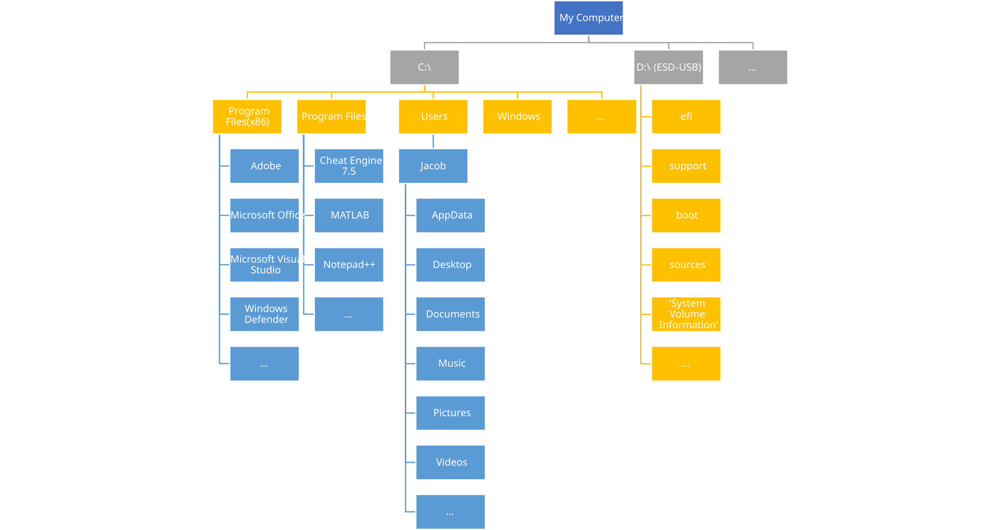

---
# File System Hierarchy - Linux

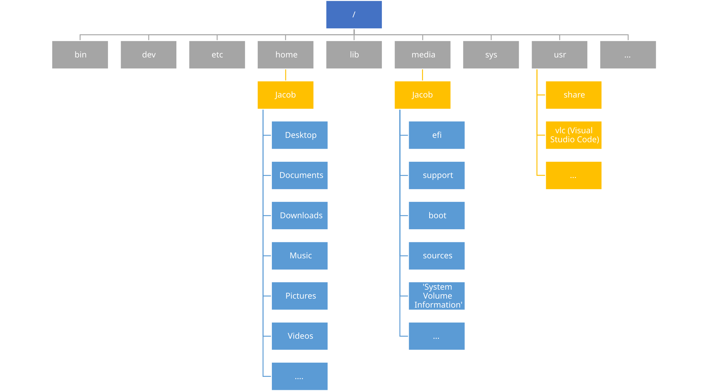

---
# File System Hierarchy - Comparison

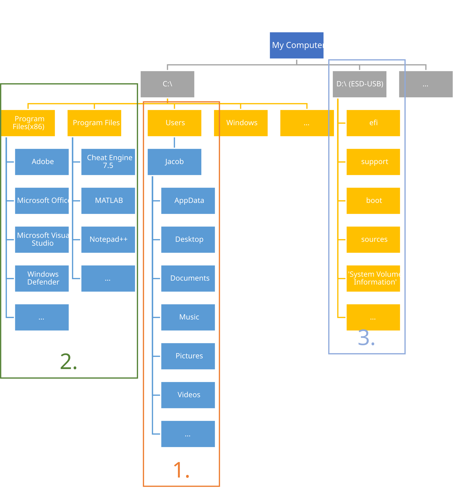 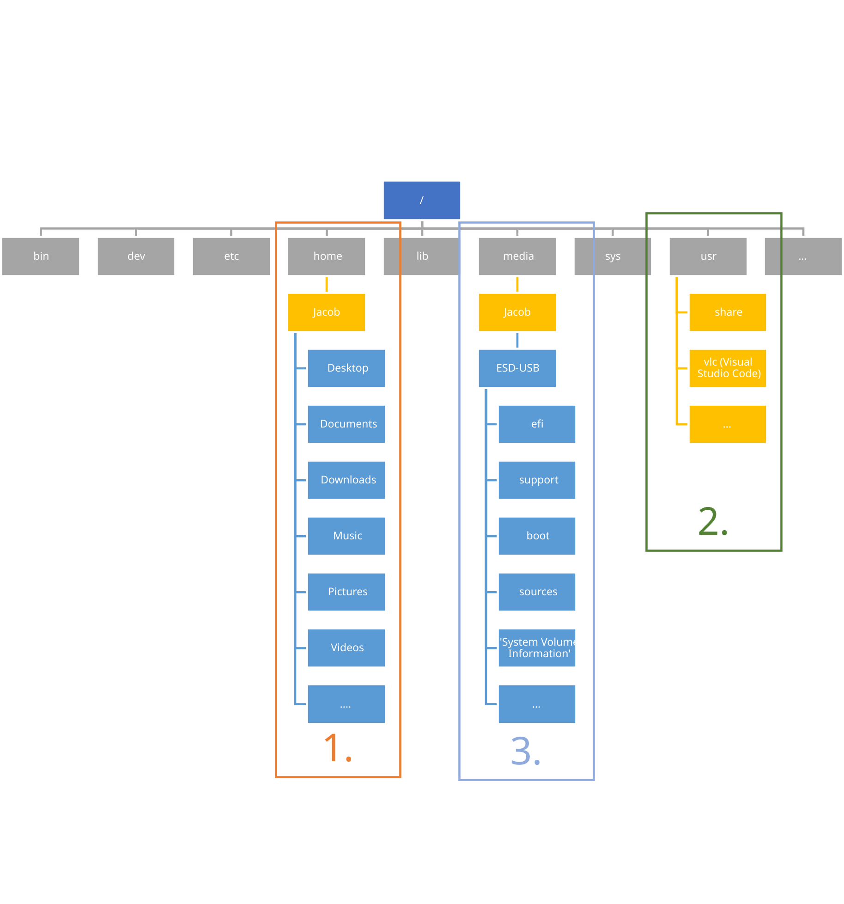

1. Files of user , 2. Apps of user, 3. External devices e.g. pendrive

---

<div class = "justify lh-10">

# Differences in File Hierarchy 
## Windows - My Computer concept:


- Provides a graphical view of all available drives and partitions, including the system drive (usually C:), external drives, network drives, etc.

- System drive (C:): 

  - Typically, the main drive where the Windows operating system and most programs are installed.

- Peripherals: 

  - Each peripheral device (e.g., USB drive, external hard drive) is usually visible as a separate entity in "My Computer".

</div>

---

<div class = "justify lh-10">

# Differences in File Hierarchy 
## Linux

__Root directory (/):__
  - This is the starting point for the entire file hierarchy. All files and directories are located directly or indirectly within the root directory.

__Directory hierarchy:__ 
  - The directory structure is more consistent and logical. Each directory has a specific purpose (e.g., /etc for configuration files, /home for user home directories).

__Peripheral devices in /media or /mnt:__
- When a peripheral device is connected, the system automatically creates a mount point for it in the /media or /mnt directory.

</div>

---

<style>
table {
  font-size: 20px;
}
</style>

# Summary of differences

| Feature | Windows | Linux |
| :--- | :--- | :--- |
| Main concept | "My Computer" | Root directory (/) |
| System drive | C: | Usually no direct equivalent, system files are scattered across various directories |
| Peripherals | Visible as separate entities | Mounted in /media or /mnt |
| Structure | Less formal, more visual | Formal, hierarchical, based on conventions |

---

# Summary of differences

<div class = "justify lh-20">

Why are there such differences?
 - __History:__ Windows was created as an operating system for home computers, with a more user-friendly interface. Linux, on the other hand, has its roots in the server environment, where consistency and efficiency are more important.
- __Philosophy:__ Linux places a greater emphasis on standards and consistency, as reflected in its file hierarchy. Windows, on the other hand, offers a more intuitive interface that may be easier for novice users.

</div>

---

<!-- _class: caption-slide -->
<!-- _paginate: skip -->

# CLI 
## (Command-Line Interface)

---

<div class = "justify lh-20">

# CLI

A command-line interface (CLI), also known as a command-line shell, is a means of interacting with software via commands – each formatted as a line of text. 

```powershell
Windows PowerShell
Copyright (C) Microsoft Corporation. All rights reserved.

Install the latest PowerShell for new features and improvements! https://aka.ms/PSWindows

PS C:\Users\Jacob> cd .\Desktop\
PS C:\Users\Jacob\Desktop> ls
PS C:\Users\Jacob\Desktop>
```
</div>

---
# Navigating the Command Line: Windows 

## From the Start menu:
1. Click the Start button in the lower left corner of the screen. 
1. Type `cmd` and press Enter. 

## From the Run dialog box
1. Simultaneously press the Windows key and R. 
1. In the opened window, type `cmd` press Enter.

```powershell {3}
Microsoft Windows [Version 10.0.22631.4602]
(c) Microsoft Corporation. All rights reserved.
C:\Users\Jacob> whoami
notebooki7\Jacob
C:\Users\Jacob>
```


---
# Navigating the Command Line: Linux 

## From the Start menu:
1. Click the Start button in the lower left corner of the screen. 
1. Click the Accessories.
1. Click the Terminal.

## Keyboard shortcut:
1. The most commonly used shortcut is Ctrl+Alt+T. 

```bash
jacob@raspberrypi:~ $ pwd
/home/jacob 
jacob@raspberrypi:~ $
```

---


# Navigating the Command Line 
## Shell

### Windows:
- __Cmd:__ The most commonly used command to open the command prompt.
To obtain the username and device name, we use the whoami command.
### Linux:
- __Terminal:__ A generic term for the window where commands are typed.
To obtain the current directory path, we use the pwd command.
### Notes:
  - __Up/down arrows:__ Browse command history.
  - __Tab:__ Autocompletes filenames, directories, and commands.

---

# Differences in Command Prompt Messages

## Between Windows and Linux

### Windows 
- __Default message:__ Typically displays the full path to the currently open directory. 
- __Example:__ ```C:\Users\User\Documents>``` 
- __Purpose:__ Provides the exact location of the user within the file system hierarchy.
### Linux 
- __Default message:__ Most often presents the username and hostname (device name). 
- __Example:__ ```user@computer:~$``` 
- __Purpose:__ Informs about the currently logged-in user and the machine they are working on.


---

# Basic Navigation and Directory Management

<div class="columns justify">
<div class="card">

## Windows:
-	```dir```:	Lists files and directories in the current directory.
- ```cd```: Changes the current directory.
- ```cd..```:	Moves up one directory level.

</div>
<div class="card">

## Linux:
- ```ls```:	Lists files and directories in the current directory.
- ```cd```:	Changes the current directory.
- ```cd ..```:	Moves up one directory level.

</div></div>

Notes:
- Both ```dir``` and ```ls``` are used to list directory contents in both different systems.
- In Linux, ```cd ..``` __requires a space between the dots, Windows does not.__


---

# Example 1 -  ```dir```,```ls```

<div class="columns">
<div class="card" >

 ```dir```:	Lists files and directories in the current directory.
 
```powershell
C:\Users\Jacob>dir
12/19/2024  12:14 PM    <DIR>          .
09/05/2023  09:06 AM    <DIR>          ..
10/05/2022  11:55 PM    <DIR>          Contacts
01/04/2025  08:29 AM    <DIR>          Desktop
09/07/2024  08:51 AM    <DIR>          Documents
01/03/2025  05:47 PM    <DIR>          Downloads
               4 File(s)            818 bytes
              42 Dir(s)  62,825,164,800 bytes free
C:\Users\Jacob>ls
ls
'ls' is not recognized as an internal or external command,
operable program or batch file.
C:\Users\Jacob>
```
</div>
<div class="card" >

 ```ls```:	Lists files and directories in the current directory. 
 
```bash
jacob@raspberrypi:~ $ ls
Bookshelf  Desktop  Documents  Downloads  Music  
Pictures  Public  Templates  Videos
jacob@raspberrypi:~ $ dir
Bookshelf  Desktop  Documents  Downloads  Music
Pictures  Public  Templates  Videos
jacob@raspberrypi:~ $


```

</div></div>

---

# Example 2 -  ```cd```, ```cd..```

<div class="columns">
<div class="card" >

## Windows

- ```cd```:	Changes the current directory.
- ```cd..```:	Moves up one directory level.
 
 
```powershell
C:\Users\Jacob>cd Desktop
C:\Users\Jacob\Desktop>cd..
C:\Users\Jacob>cd Desktop
C:\Users\Jacob\Desktop>cd ..
C:\Users\Jacob>cd /
C:\>
```


</div>
<div class="card" >

## Linux

- ```cd```:	Changes the current directory.
- ```cd ..```:	Moves up one directory level. 
 
```bash
jacob@raspberrypi:~ $ cd Desktop
jacob@raspberrypi:~/Desktop $ cd ..
jacob@raspberrypi:~ $ cd Desktop
jacob@raspberrypi:~/Desktop $ cd..
-bash: cd..: command not found
jacob@raspberrypi:~/Desktop $ cd /
jacob@raspberrypi:/ $ pwd
/
jacob@raspberrypi:/ $
```

</div></div>


---

# Text Manipulation and Output

## Windows:
```echo```: Displays a message on the screen.
## Linux:
```echo```: Displays a message on the screen.

__Note__: Both ```echo``` commands have similar functionality, but there might be slight variations in options and behavior.

---

# Example 3 - ```echo```

```echo```: Displays a message on the screen.

<div class="columns">
<div class="card" >

## Windows
 
 
```powershell
C:\Users\Jacob>echo Hello World!
Hello World!
C:\Users\Jacob> echo "Hello World!"
"Hello World!"
C:\Users\Jacob>echo.

C:\Users\Jacob>echo
ECHO is on.
C:\Users\Jacob>

```


</div>
<div class="card" >

## Linux
 
```bash
jacob@raspberrypi:~ $ echo Hello World!
Hello World!
jacob@raspberrypi:~ $ echo "Hello World!"
Hello World!
jacob@raspberrypi:~ $echo

jacob@raspberrypi:~ $echo.
-bash: echo.: command not found
jacob@raspberrypi:~ $

```

</div></div>


---

<div class = "justify lh-30">

# Redirection

```powershell
echo Hello, world!
```
To redirect output to a file: ```echo Hello, world! > myfile.txt```

__Note__: Redirection works similarly in both systems, using the ```>``` symbol to overwrite a file and ```>>``` to append to a file.

</div>

---

<!-- _class: code-description invert -->

# Example 4 - ```echo```

```powershell
C:\Users\Jacob>echo Hello world! > myfile.txt
C:\Users\Jacob>

```

- The simplest way to create a new file.
- Redirection works similarly in both systems, using the ```>``` symbol to overwrite a file and ```>>``` to append to a file.

<div class="result-box">
  <div class="result-header">
    myfile.txt
  </div>
  <div class="result-content">
    Hello world
  </div>
</div>

---

# Creating and Deleting Files and Directories

## Windows:
```copy```:	Copies files.
```del```:	Deletes files.
```md```:	Makes a new directory.
## Linux:
```cp```:	Copies files.
```rm```:	Removes files or directories.
```mkdir```:	Makes a new directory.

---

# Example 5 - ```copy```,```del```,```md```--- ```cp```,```rm```,```mkdir```

<div class="columns">
<div class="card" >

## Windows
 
```powershell
C:\Users\Jacob>md Folder
C:\Users\Jacob>dir
01/04/2025  10:06 AM    <DIR>          Folder
07/16/2023  07:09 AM    <DIR>          Music
...
C:\Users\Jacob> cd Folder
C:\Users\Jacob\Folder> echo. > empty.txt
C:\Users\Jacob\Folder> copy empty.txt copyEmpty.txt
...
01/04/2025  12:22 PM    <DIR>          .
01/04/2025  10:08 AM    <DIR>          ..
01/04/2025  12:19 PM                 3 copyEmpty.txt
01/04/2025  12:19 PM                 3 empty.txt
...
C:\Users\Jacob\Folder> del copyEmpty.txt
C:\Users\Jacob\Folder>
```


</div>
<div class="card" >

## Linux

 
```bash
jacob@raspberrypi:~ $ mkdir Folder
jacob@raspberrypi:~ $ ls
Bookshelf  Desktop  Documents  Downloads  Folder  
...
jacob@raspberrypi:~ $ cd Folder
jacob@raspberrypi:~/Folder $ echo > empty.txt
jacob@raspberrypi:~/Folder $ cp empty.txt copyEmpty.txt
...
jacob@raspberrypi:~/Folder $ ls
copyEmpty.txt  empty.txt
...
jacob@raspberrypi:~/Folder $ rm copyEmpty.txt
jacob@raspberrypi:~/Folder $

```
</div></div>


---
<div class = "justify lh-10">

# Executing Compiled Programs

## Windows:
- o run a compiled program, you usually just type the program name, followed by the ```.exe``` extension: ```program_name.exe```.
- Windows will automatically add the .exe extension if it is omitted.
## Linux:
- To run a compiled program, you typically use the following syntax: ```./program_name```. 
- The ```./``` part specifies that the program should be executed in the current directory.


---

# Example 6 - ping

<div class="columns">
<div class="card" >

## Windows


```powershell
C:\Users\Jacob>cd C:\Windows\System32
C:\Windows\System32>ping.exe www.google.com

Pinging www.google.com [172.217.14.228] with 32 bytes of data:
Reply from 172.217.14.228: bytes=32 time=16ms TTL=113
Reply from 172.217.14.228: bytes=32 time=16ms TTL=113
Reply from 172.217.14.228: bytes=32 time=16ms TTL=113
Reply from 172.217.14.228: bytes=32 time=16ms TTL=113

Ping statistics for 172.217.14.228:
    Packets: Sent = 4, Received = 4, Lost = 0 (0% loss),
Approximate round trip times in milli-seconds:
    Minimum = 16ms, Maximum = 16ms, Average = 16ms

C:\Windows\System32>

```


</div>
<div class="card" >

## Linux

 
```bash
jacob@raspberrypi:/usr/bin $ ./ping www.google.com

PING www.google.com (172.217.14.228) 56(84) bytes of data.
64 bytes from sea30s02-in-f4.1e100.net (172.217.14.228): icmp_seq=1 ttl=115 time=16.2 ms
64 bytes from sea30s02-in-f4.1e100.net (172.217.14.228): icmp_seq=2 ttl=115 time=16.0 ms
64 bytes from sea30s02-in-f4.1e100.net (172.217.14.228): icmp_seq=3 ttl=115 time=16.1 ms
64 bytes from sea30s02-in-f4.1e100.net (172.217.14.228): icmp_seq=4 ttl=115 time=16.0 ms
64 bytes from sea30s02-in-f4.1e100.net (172.217.14.228): icmp_seq=5 ttl=115 time=16.0 ms
^C
--- www.google.com ping statistics ---
5 packets transmitted, 5 received, 0% packet loss, time 4006ms
rtt min/avg/max/mdev = 16.013/16.068/16.192/0.069 ms

jacob@raspberrypi:/usr/bin $


```
</div></div>

---

# Additional tools

## Clear the console

- To clear the console/terminal window, use the appropriate command, such as __Windows__: ```cls``` __Linux__: ```clear```

## Rename file
- Instead of copying a file to a new name, you can use a command to rename the file. The syntax is identical to that of copying. __Windows__ ```rename``` __Linux__ ```mv```

## Help 
- To obtain additional assistance on using the application, please type the program name followed by a space and __Windows__: ```/h```, ```-h``` __Linux__: ```--h```

---
<div class = "justify lh-20">

# IP address

An IP address is like a unique mailing address for every device connected to the internet. It allows computers to locate and communicate with each other. Think of it as a numerical label assigned to each device, making it possible for data to be sent to the correct destination.


## Windows: ```ipconfig``` 
## Linux: ```ip addr```


---

# Example 7 - IP

<div class="columns">
<div class="card" >

## Windows


```powershell
C:\Users\Jacob>ipconfig
...
Ethernet adapter Ethernet 4:

   Connection-specific DNS Suffix  . : butte.campus
   Link-local IPv6 Address . . . . . : fe80::813a:b45d:4cd4:63fb%26
   IPv4 Address. . . . . . . . . . . : 10.38.32.232
   Subnet Mask . . . . . . . . . . . : 255.255.255.0
   Default Gateway . . . . . . . . . : 10.38.32.254
...
C:\Users\Jacob>


```

</div>
<div class="card" >

## Linux

 
```bash
jacob@raspberrypi:~ $ ip addr
...
2: eth0: <BROADCAST,MULTICAST,UP,LOWER_UP> mtu 1500 
qdisc pfifo_fast state UP group default qlen 1000
    link/ether b8:27:eb:dc:64:a3 brd ff:ff:ff:ff:ff:ff
    inet 10.38.32.256/24 brd 10.38.32.255 scope global dynamic noprefixroute eth0
       valid_lft 525094sec preferred_lft 438694sec
    inet6 fe80::d8c5:56d0:e193:bd13/64 scope link
       valid_lft forever preferred_lft forever
...
jacob@raspberrypi:~


```
</div></div>

---

<!-- _class: caption-slide -->
<!-- _paginate: skip -->

# Console
## Assignment 01

---

<div class = "justify lh-25">

# Assignment 01 - Console

1. Please go to the course page on Canvas to find Assignment 01. 
2. Complete the tasks and submit your result in the designated area according to the guidelines.

⏱ Time limit: 15 minutes

</div>

---

<!-- _class: caption-slide -->
<!-- _paginate: skip -->

# Toolchain 
## Setup

---
# Toolchain Setup

## Read
https://github.com/jpach-cs/jpach-cs.github.io/releases/tag/compiler

## Downolad
https://github.com/jpach-cs/jpach-cs.github.io/releases/download/compiler/MinGW.zip

---

# Git Setup

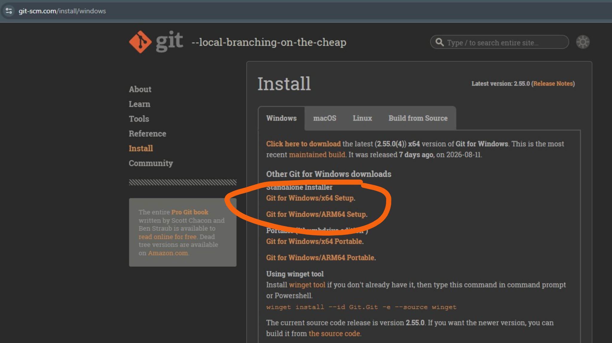

## Downolad

https://git-scm.com/install/windows

---


<!-- _class: caption-slide -->
<!-- _paginate: skip -->

# Compiler
<!-- ## Subtitle -->


---

# The Compilation Process: A Two-Stage Journey

<div class = "justify lh-15">


Turning source code into a running program happens in two distinct steps:
__Stage 1__: Compilation (.c $\to$ .o)

- __What it does__: Translates your C source code into machine code (binary instructions for the CPU).
- __Command__: ```gcc -g -Wall -std=c99 -pedantic -c input.c -o output.o```
- __Output__: An object file (main.o).
- __Key characteristic__: It contains machine code for your file, but it does not yet know where standard library functions (like printf or scanf) are located. References to them remain unresolved.

</div>

---
# The Compilation Process: A Two-Stage Journey

<div class = "justify lh-25">

__Stage 2__: Linking (.o $\to$ Executable)

- __What it does__: Combines your object file(s) with standard libraries and startup code.
- __Command__: ```gcc -g output.o -o program.exe```
- __Output__: A final executable file (main.exe or binary).
- __Key characteristic__: The linker resolves all missing references, connects external library functions, and produces a complete, runnable program.

</div>

---


# Compiler
<div class = "justify lh-20">

1. A compiler takes the entire source code and translates it into a machine code file, often called __an executable__. 

1. This executable file contains instructions that the computer's processor can directly execute. 

1. Once compiled, the program can run independently without the need for the original source code or a compiler.

</div>

---

<style scoped>
  /* Zmiany zastosują się TYLKO do tego slajdu */
  .columns {
    display: flex;
    align-items: center;
    gap: 30px;
  }
  .column-left {
    flex: 0 0 auto;
  }
  .column-right {
    flex: 1;
    font-size: 0.52em;
    line-height: 1.35;
  }
  .column-right p {
    margin-bottom: 12px;
  }
  .footer-summary {
    font-size: 0.6em;
    margin-top: 15px;
  }
</style>

<div>

# Extended descrpition

<div class="columns">
<div class="column-left">

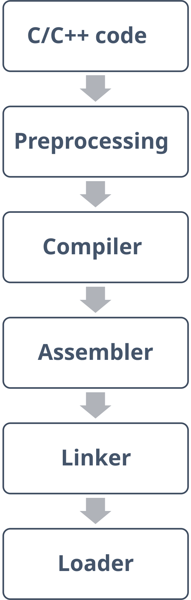  
</div>

<div class="column-right justify lh-30">

1. This is the source code you have written in the C/C++ programming language. It forms the basis of your program.
2. During this stage, the preprocessor processes your source code. It includes header files (e.g., stdio.h, math.h) using directives like #include and expands macros defined with #define. The output of this stage is the preprocessed source code.
3. The compiler takes the preprocessed source code and translates it into assembly code. This assembly code is a low-level representation of your program that is specific to the target architecture. 
4. The assembler converts the assembly code into object code. Object code is a machine-readable format that contains instructions and data. 
5. The linker combines the object code with other necessary libraries (e.g., standard C library) to create the final executable program. This process resolves external references and creates a complete program that can be run.
6. The loader loads the executable program into memory (RAM) so that it can be executed by the CPU. The running program is often referred to as a process.

  </div>

</div>

---

<!-- _class: caption-slide -->
<!-- _paginate: skip -->

# Compilation
## Practical exercise

---

# Practical exercise - Compilation 

1. Create a new folder in your desktop.     ⏱ Time limit: 5 minutes
2. Create a file named main.c inside it and fill it with the simplest possible code:
```c
// main.c
#include <stdio.h>
int main() 
{ 
  printf("%s\n", "Hello, world!");
  return 0;
} 
```
3. Compile ```main.c``` with ```cmd``` into an object file ```main.o```: 
```gcc -g -Wall -std=c99 -pedantic -c main.c -o main.o```
4. Link the object file ```main.o``` into an executable ```main.exe```: ```gcc -g main.o -o main.exe```


---

<!-- _class: caption-slide -->
<!-- _paginate: skip -->

# How to get
## Visual Studio Code

---

# Not here! 
## On your personal computer!

- Please do not install VSC on university computers. 
- Everything should already be installed. You only need to check the VSC extensions.

---
# Go to: 
## https://code.visualstudio.com/

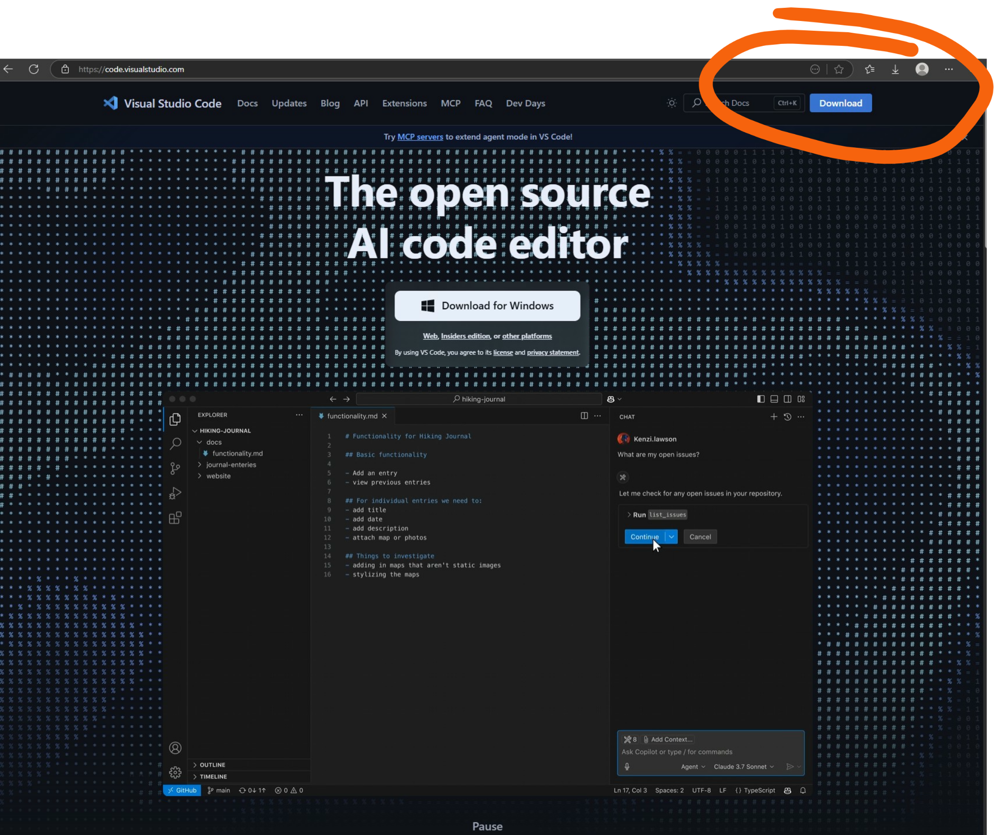

---

# Select System Installer x64:

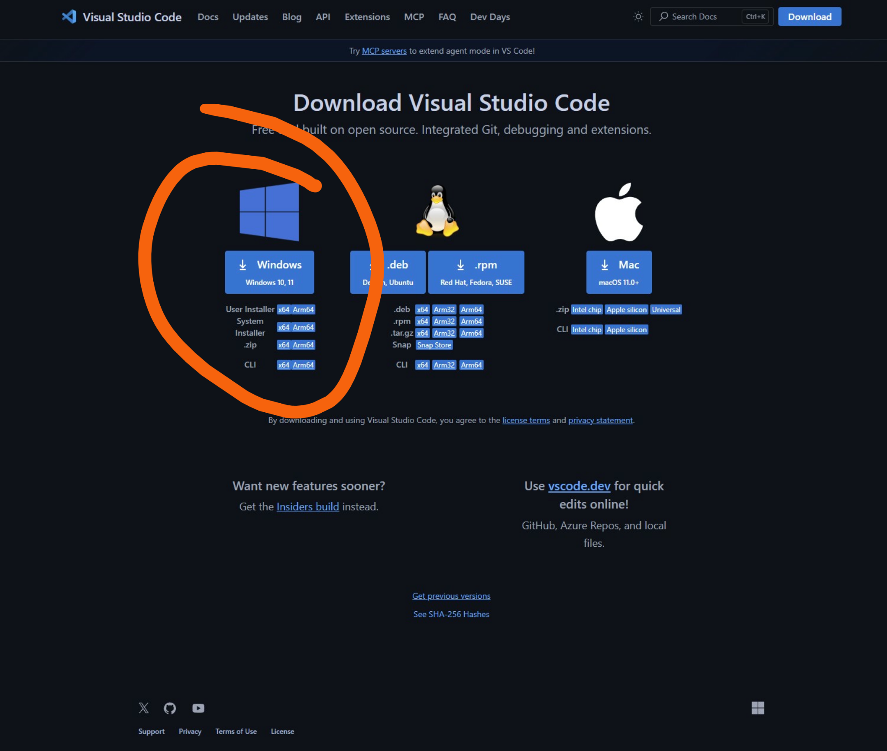

---
# Download & install: VSCodeSetup-x64.exe 

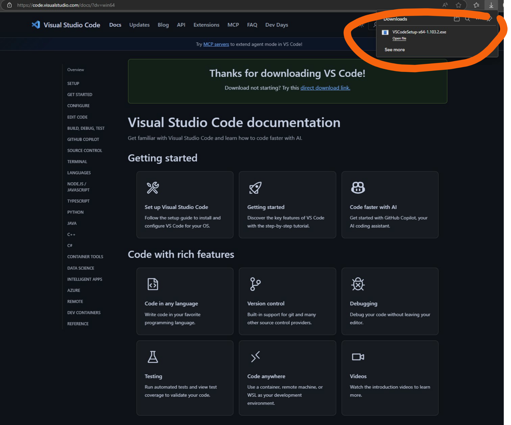

---

<div class="justify lh-10">

# Behind the Magic: IDE vs. Manual Control

- __Full Visual Studio__: 
Hides complexity. Project types, targets, output folders, and dependencies are "clicked" into existence automatically.
- __The Programmer's Reality__: 
A professional must understand the underlying mechanics: a source file (```.c```) and a compiler (```gcc.exe```).
- __VS Code__: 
By default, it's just a text editor. To turn it into an __IDE__ that compiles, runs, and debugs step-by-step, we need explicit configuration rules.

The ```.vscode folder```: Stores these rules in a specific format (JSON). For now, we will use ready-made templates — __we'll break them down piece by piece in upcoming weeks!__
</div>

---

# Integrated development environment

<div class="card justify lh-20">

An Integrated Development Environment (IDE) is a comprehensive software application that consolidates the essential tools needed for software development into a single graphical user interface. It typically combines:

1. a source __code editor__ for writing code
1. a __compiler__ and __linker__ to transform that code into an executable program.
1. a built-in __debugger__ to help developers identify and resolve logical errors

efficiently during the programming process.

</div>

---

# Open extensions

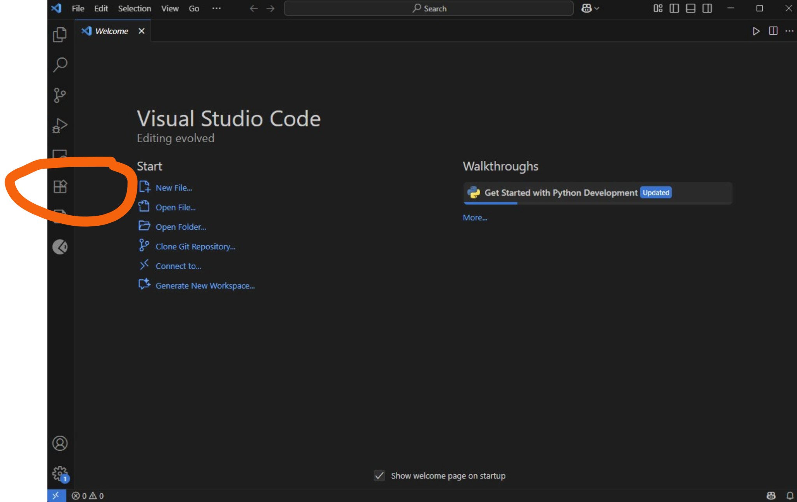

---

# Install extensions

## C/C++; C/C++ Extension Pack; C/C++ Themes

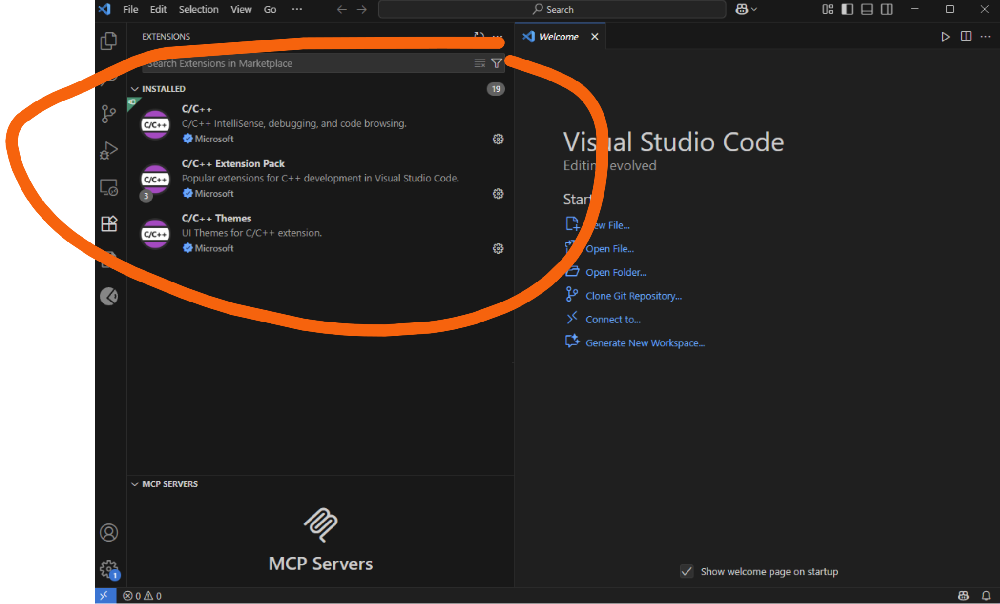

---

# Open Template code

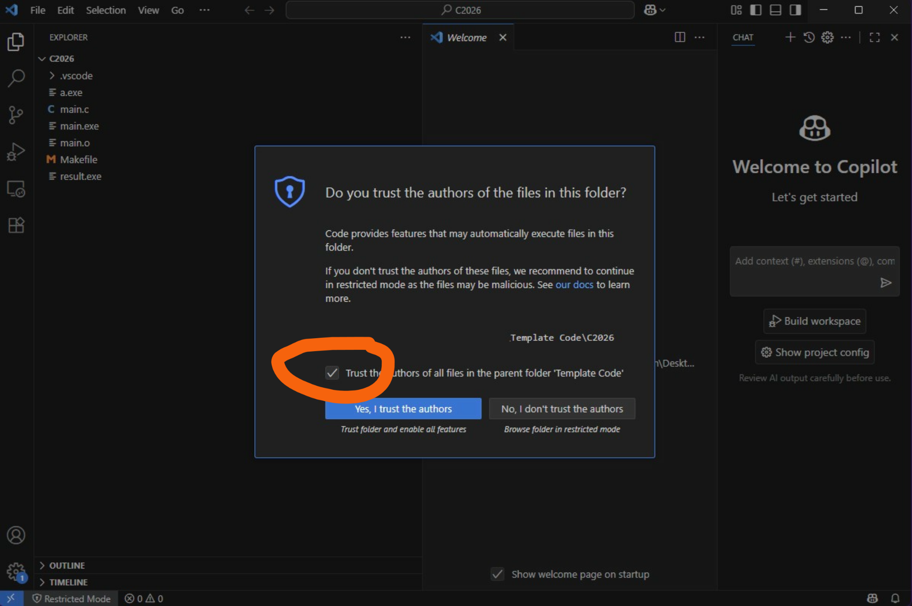

---

# Read your first C program – main.c

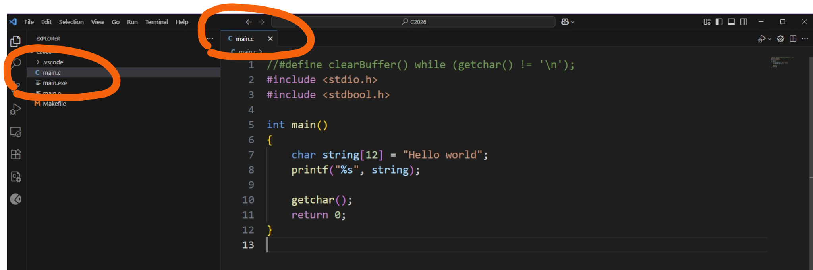

---

# Run your first C program


---

<!-- _class: caption-slide -->
<!-- _paginate: skip -->

# Anatomy 

## and Philosophy of Debugging

---

# What is debugging and where did it come from?

<div class = "justify lh-10">

- __Definition:__ Debugging is the process of identifying, analyzing, and removing errors (bugs) in source code.
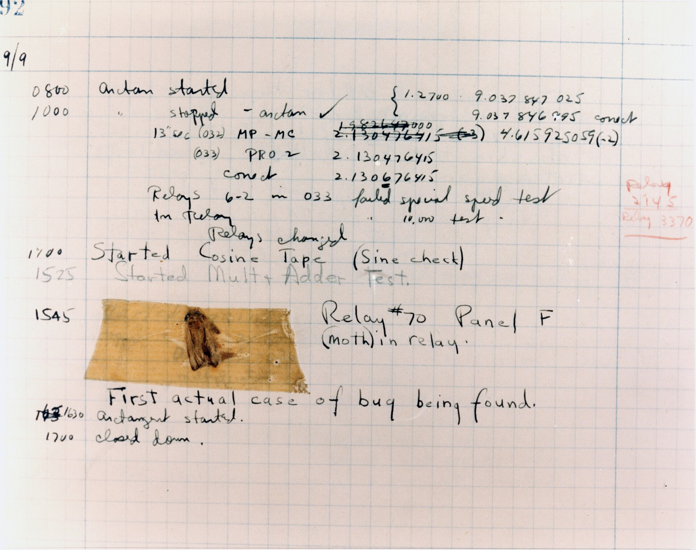
- __Where does the name come from?__ The term __bug__ in computing was popularized by pioneer programmer Grace Hopper in 1947. While working on the Harvard Mark II computer, a literal moth was found stuck in an electromechanical relay. Although the term existed earlier in engineering, this event became a permanent legend in computer science.

</div>

---

# How does the CPU execute code?

## (Hardware perspective)

<div class = "justify lh-20">


- __Sequencing:__ The computer's processor executes instructions one after another (sequentially), step by step (with rare exceptions like jumps or interrupts).
- __The magic of the breakpoint:__ We can place a __breakpoint__ at specific executable locations in our code. This gives us the ability to halt the processor's execution right at the fragment of the program we are interested in and switch to step-by-step mode.
- __Note__: A *statement* in C __is not always equal to a single line__ of text in your editor. One line can contain multiple statements, or one statement can span multiple lines!

</div>

---

# What is a Breakpoint?

<div class = "justify lh-25">

- A breakpoint is a __marker or request for the debugger__ (which is a separate program overseeing our code) specifying the exact place where it should pause the program's execution.
- The program does not "know" it is approaching a breakpoint – for it, a moment simply arrives where control is momentarily taken over by the monitoring tool.

</div>

---

# The Principle of Frozen Time

<div class = "justify lh-25">

- When a program is paused at a breakpoint, __from its perspective, time simply stands still__.
- The application has no awareness that someone is watching it, or that an external user can modify its states (variables, memory) at that moment without its *knowledge*.
- This gives us a completely safe space to analyze what is happening *under the hood*.

</div>

---

# Controlling Execution

<div class = "justify">

The standard set of debugger controls is divided into classic controls and environment-specific additions.

## Classic flow control:

- __Continue (`F5`):__ Resume free execution of the program until the next breakpoint or program termination.
- __Step Over (`F10`):__ Execute the current statement and stop at the next one. If the line contains a function call, __we do not step into it__ – we treat it as a single operation.
- __Step Into (`F11`):__ Step inside the called function. A crucial tool for tracking the exact logic flow step by step.
- __Step Out (`Shift + F11`):__ Finish executing instructions in the current function, step out of it, and stop at the place it was called from.

</div>

---
# Visual Studio Code additions

<div class = "justify">

- __Restart (`Ctrl + Shift + F5`):__ A quick reset and restart of the debugging session.
- __Stop (`Shift + F5`):__ Abruptly stop / kill the process.

## ⚠️ IMPORTANT RULE FOR BEGINNERS

- Avoid hastily using the __Stop-button__ as an *emergency exit*. Killing the process acts like abruptly pulling the plug from the socket. While the operating system will reclaim memory, the program itself is denied the chance to perform its normal cleanup operations (like closing files gracefully or saving states).
- In hardware programming (e.g., controlling GPIO pins in courses like CS 255), abruptly killing a process might leave a physical pin active. Leaving hardware components powered on without software control can lead to unexpected behavior or even physical hardware damage! Always strive for a graceful exit.

</div>

---

<!-- _class: caption-slide -->
<!-- _paginate: skip -->

# Practice  
## exercise

---

# 1. Open the Run and Debug View

(Click the __Run and Debug__ icon on the left Activity Bar to open the debugging panel).


---

# 2. Expand the Configuration Dropdown

(Click the dropdown menu at the top of the panel to see available execution tasks).


---

# 3. Select the Execution Task

(Choose the first option from the list – standard execution without stopping).

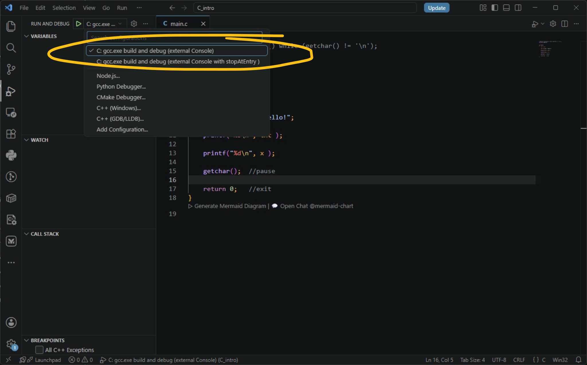

---
# 4. Start Normal Execution (F5)

(Click the green Play button or press F5 to run the program from start to finish).

## Press Enter


---
# 5. Set Your First Breakpoint

(Left-click in the gutter to the left of the line numbers. ).

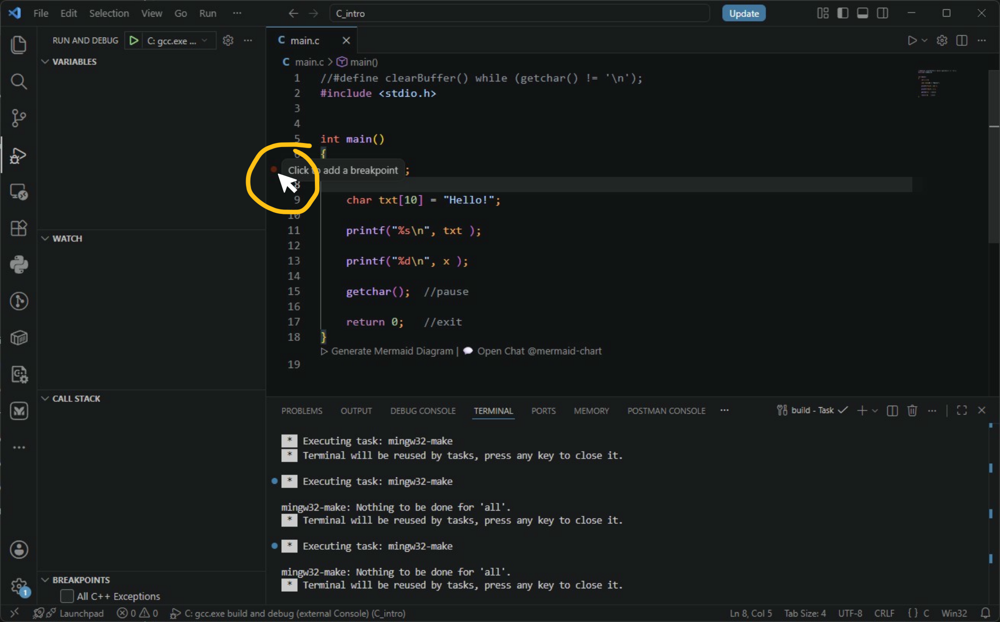

---
# 6. Set Your First Breakpoint

( A solid red dot will appear and stay there).


---
# 7. Restart in Debug Mode

(Press F5 again. Because a breakpoint is set, the program will now pause execution exactly at the red dot).


---
# 8. Inspect Variables via Hover

(Move your mouse cursor over any variable name in the code to reveal its current value).

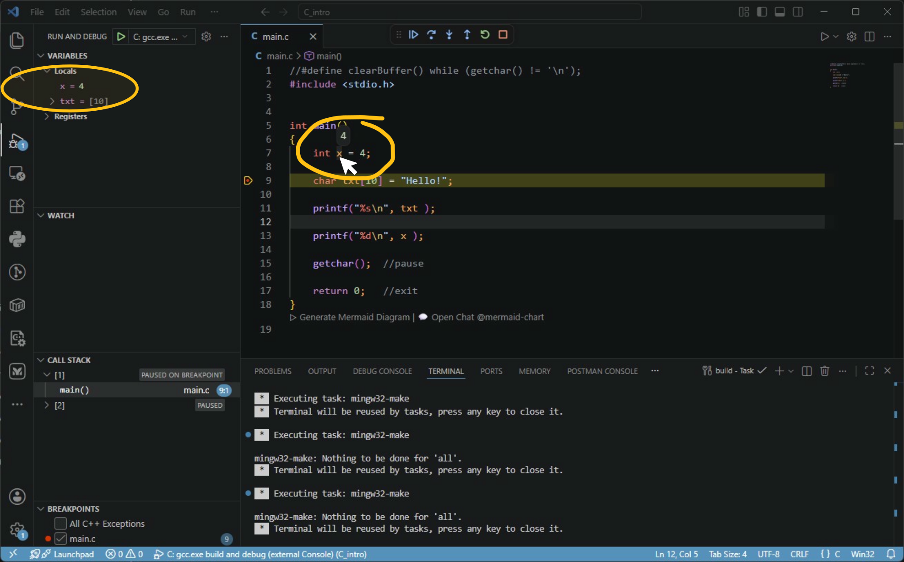

---
# 9. Step Over (F10) to the Next Statement

(Press F10 to execute the highlighted line and safely move to the next statement in your code).

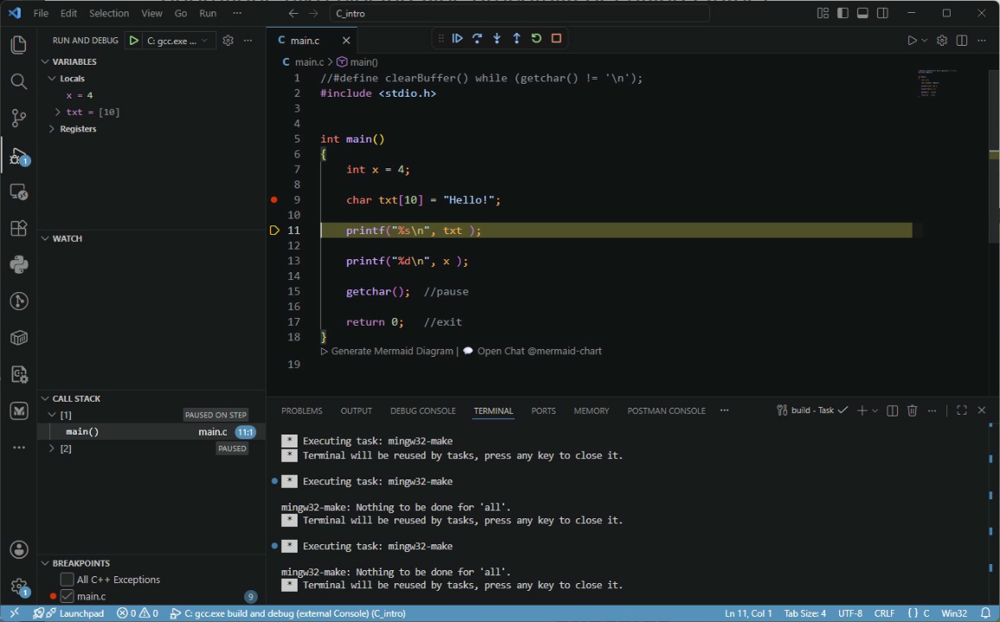

---

# Visual Cues in the Interface

<div class = "justify lh-25">

- __Yellow highlight:__ When the program stops at a breakpoint, the line of code __BEFORE__ which the pause occurred is clearly highlighted in yellow. This means: *"This is the instruction that is about to be executed"*.
- __Hover preview:__ If you hover your mouse cursor over any variable name in the paused code, VS Code will display a small popup with its current value at that exact fraction of a second.

</div>

---

# Program State Tracking Panes 1/2

<div class = "justify">

During debugging, the VS Code sidebar provides four fundamental tools to inspect the program's state:

1. __Variables:__
   - Shows a breakdown into local variables (available in the current function scope) and global variables.
   - Allows you to observe in real-time how values change as you step through subsequent lines of code.
2. __Watch:__
   - A place where you can manually drag or type specific variables or arithmetic expressions to keep an eye on them in one place.

</div>

------

# Program State Tracking Panes 2/2

<div class = "justify lh-25">

3. __Memory (sneak peek):__
   - The debugger doesn't just read variable names; it can look directly into the raw computer memory.
4. __Call Stack:__
   - Shows history – "who called whom" (the chain of functions leading to the current location in the code).

</div>

---

<!-- _class: caption-slide -->
<!-- _paginate: skip -->

# Advanced Debugging

## Full Control Over Program State

---

<div class = "justify">

# Conditional Breakpoints

- __The Problem:__ You have a loop that runs 10,000 times. A bug (such as a division by zero or a null pointer) only occurs on iteration 9,998. Pressing `F5` thousands of times is out of the question.
- __The Solution:__ Instead of a standard stop, we tell the debugger to evaluate a logical expression. The program will pause __only when__ the condition evaluates to true.
- __How to do it in VS Code:__ Right-click the red breakpoint dot -> *Edit Breakpoint* -> choose *Expression*.
- __Example expressions:__ `i == 9998`, `ptr == NULL`, `array[i] < 0`.

</div>

---

<div class = "justify">

# Logpoints

## (Tracepoints) – Debugging Without Pausing

- __The Problem:__ You want to track changing values in real time, but pausing the program disrupts its execution flow. Traditionally writing `printf` or `cout` litters your source code and requires recompilation.
- __The Solution:__ A Logpoint (marked with a diamond instead of a dot in VS Code). This is a special point that, instead of pausing the CPU, injects a message directly into the Debug Console.
- __How to do it:__ Right-click the line gutter -> *Add Logpoint*.
- __Syntax:__ Wrap variables in curly braces. E.g.: `Iteration: {i}, current pointer: {ptr}`.

</div>

---

<div class = "justify">

# Call Stack and Context Switching 
## (Time Travel)
- __Anatomy of the Stack:__ The *Call Stack* is not just a history of calls. It is a stack of memory *Stack Frames*. When `main()` calls `process_data()`, and it calls `calculate()`, each has its own isolated memory space for local variables.
- __Context Switching:__ While paused inside `calculate()`, you can click on `main()` in the *Call Stack- panel.
- __What happens?__ Time is still frozen, but VS Code "rewinds" your perspective. You see the local variables of `main()` in the exact state they were "frozen" right before calling the next function. This is crucial for verifying what arguments were actually passed upstream.

</div>

---

<div class = "justify">

# Advanced Watch and Type Casting

- __The Problem:__ The debugger is not clairvoyant. If you pass data through a generic `void *ptr`, the *Variables* panel will only show a memory address without values, because the debugger doesn't know what type of data it holds.
- __The Solution (Casting):__ In the *Watch* panel, you can cast types on the fly using standard C syntax to force the debugger to interpret the bits correctly.
- __Examples for the Watch panel:__
  - `(int *)ptr` – interpret this raw address as a pointer to an integer.
  - `((struct Node *)ptr)->next` – treat the address as a node structure and show me the element it points to.
  - `my_array, 10` (debugger-dependent syntax for GDB/LLDB) – show me not just the first element, but the next 10 elements in memory as an array.

</div>

---

<div class = "justify">

# Raw Memory Inspection

- __Beyond Abstraction:__ Sometimes casting isn't enough. You want to see exactly, byte by byte, what resides in RAM on the Stack or Heap.
- __How to do it:__ Right-click any pointer or variable in the *Variables* panel and select *View Memory* (requires an extension in VS Code, like Hex Editor).
- __What it's used for:__
  - Analyzing memory padding inside structs.
  - Searching for hidden null-terminators `\0` in corrupted strings.
  - Verifying whether memory allocated via `malloc` or modified by `memset` was actually zeroed out.

</div>

---

<div class = "justify">

# Data Breakpoints - *Who Corrupted My Variable*


- __Every C Programmer's Worst Nightmare:__ A variable's or structure's value gets corrupted, but you have no idea when or where. Some "wild" pointer elsewhere in the codebase overwrote a random chunk of memory. A standard line-based breakpoint won't help here.
- __The Solution:__ *Data Breakpoint* (often called a *Watchpoint*).
- __How it works:__ Instead of saying "stop at line 45", you tell the debugger: __"Pause the CPU the exact millisecond the contents of memory at address `0x7fffc00` change"__.
- __Effect:__ The program runs freely until it is abruptly stopped right on the instruction that attempted to overwrite the observed data structure. This is the ultimate weapon against memory leaks and corruptions.

</div>

---

<!-- _class: caption-slide -->
<!-- _paginate: skip -->

# Thank

## You
